# Plan: GitHub Actions → SSH Auto-Deploy to exe.dev

> **Source:** Conversation request — automate the manual exe.dev deploy currently documented in `docs/deploy.md` §"Updating the server".
> **Created:** 2026-05-13
> **Status:** planning

## Goal

On every push to `main`, GitHub Actions builds the server + web SPA, rsyncs the build artifacts to the exe.dev VM over SSH, runs DB migrations, restarts pm2, and verifies `/health` — replacing the manual `ssh → git pull → bun build → migrate → pm2 restart` flow.

## Acceptance Criteria

- [ ] A push to `main` triggers `.github/workflows/deploy.yml` and the workflow turns green end-to-end.
- [ ] After a successful run, `curl https://claude-sessions.exe.xyz/health` returns `{"status":"ok"}` for the freshly-deployed commit (verified inside the workflow).
- [ ] The deployed commit SHA is reflected in pm2 logs / a `/version` marker or the workflow summary.
- [ ] Build runs **in Actions**; only `dist/` + migrations + `package.json`s are transferred to the VM. No `bun install`/`bun build` runs on the VM.
- [ ] DB migrations run on the VM as part of the deploy. If migrations fail, the workflow fails red and pm2 is **not** restarted.
- [ ] Secrets (`SSH_PRIVATE_KEY`, `SSH_HOST`, `SSH_USER`, `SSH_KNOWN_HOSTS`) are GitHub repo secrets; no plaintext keys/hosts in YAML.
- [ ] `scripts/deploy.sh` is checked in, idempotent, and runnable by hand on the VM (so the deploy is auditable and the workflow stays thin).
- [ ] `docs/deploy.md` is updated to reference the automated flow as the new default and the manual flow as the fallback.

## Decisions (from Q&A)

| Question | Decision |
|---|---|
| Trigger | `push` to `main` only |
| Build location | **GitHub Actions** (rsync `dist/` to VM) |
| Secrets | GitHub **repo** secrets |
| Failure handling | Fail loudly, no auto-rollback |
| VM-side execution | Checked-in `scripts/deploy.sh` invoked over SSH |
| CLI | **Out of scope** — server/web only |

## Codebase Context

### Files the workflow / deploy script touch

- **Build outputs** to rsync (must exist after Actions build step):
  - `packages/core/dist/`
  - `packages/adapter-claude/dist/`
  - `packages/server/dist/`
  - `packages/web/dist/`
- **Migrations**: `packages/server/src/db/migrations/*.sql` — copied to `packages/server/dist/src/db/migrations/` (see `docker-compose.yml` line 53 — the running container mounts migrations there; the VM deploy must mirror this).
- **Migration entrypoint**: `bun run --filter @claude-sessions/server db:migrate` — referenced in `docs/deploy.md:241,561`. Plan assumes this script exists in `packages/server/package.json`; Phase 1 verifies and pins a no-bun alternative if needed.
- **Server entrypoint**: `packages/server/dist/src/main.js` — pm2 runs this (see `docs/deploy.md:288`).
- **Health endpoint**: `GET /api/health` (per `docker-compose.yml:69`) and `GET /health` (per `docs/deploy.md:311`). Phase 4 confirms which one is current and uses that in the post-deploy check.

### Existing patterns to follow

- **Bun + Turborepo build commands**: `bun install` then per-package `bun run --filter <pkg> build` (see `docs/deploy.md:200-205`). Use the same in CI.
- **pm2 process name**: `claude-sessions-api` (per `docs/deploy.md:288`). The restart command is `pm2 restart claude-sessions-api`.
- **VM layout**: app lives at `~/claude-sessions` on the VM, `.env` at `~/claude-sessions/.env` (mode 0600). `scripts/deploy.sh` must `cd ~/claude-sessions` and `export $(cat .env | xargs)` exactly as the doc does.

### No existing CI

- `.github/` directory does **not** exist in the repo. Phase 1 creates it from scratch. No prior workflows to clash with.

### Test infrastructure (not directly exercised by this plan)

- `bun run test`, `bun run typecheck`, `bun run lint`, `bun run build` are all wired through Turbo at the workspace root.
- The deploy workflow will run `typecheck` + `lint` + `build` as gates before any rsync. It will **not** run the full integration test suite (testcontainers + Postgres), since that's expensive and is the job of a separate `ci.yml` (out of scope here — see Future Work).

## Phase Graph

```dot
digraph phases {
  rankdir=LR
  node [shape=box]

  phase_1 [label="Phase 1: deploy.sh\n(VM-side script, manually testable)"]
  phase_2 [label="Phase 2: GH Actions workflow\n(build + rsync + invoke deploy.sh)"]
  phase_3 [label="Phase 3: Secrets + first live run"]
  phase_4 [label="Phase 4: Health-check gate + docs update"]

  phase_1 -> phase_2 -> phase_3 -> phase_4
}
```

Phases are sequential — each depends on the previous one to be exercisable end-to-end. Phase 1 is independently testable on the VM by hand, which de-risks the rest.

## Phases

- [phase-1.md](./phase-1.md) — `scripts/deploy.sh`: idempotent VM-side deploy script (migrate + pm2 restart + health probe).
- [phase-2.md](./phase-2.md) — `.github/workflows/deploy.yml`: build in CI, rsync `dist/`, invoke `deploy.sh` over SSH.
- [phase-3.md](./phase-3.md) — Configure GitHub repo secrets, run the workflow live end-to-end against the real VM.
- [phase-4.md](./phase-4.md) — Add post-deploy health-check gate in CI, update `docs/deploy.md` to reflect the automated flow.

## Out of Scope / Future Work

- **Staging environment**: single-VM, single-environment for v0. A second `staging` VM + a `deploy-staging.yml` is a later iteration.
- **Auto-rollback**: explicitly deferred (per Q&A). On failure, fix forward.
- **CLI release pipeline**: CLI stays user-installed.
- **Full CI test suite** (`ci.yml` with testcontainers): separate concern. The deploy workflow only runs typecheck + lint + build as cheap gates.
- **Blue/green or zero-downtime**: pm2 restart causes a brief blip. Acceptable for single-user v0.
- **Database backup before migrate**: the nightly `pg_dump` cron from `docs/deploy.md:506` is the safety net.
