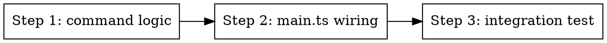

# Phase 5: New `summarize` CLI command

> **Status:** pending
> **Traces to:** REQ-008, REQ-009, REQ-010, REQ-011, EDGE-006, EDGE-007, EDGE-008, EDGE-009, EDGE-012, EDGE-013

## Overview

Add `claude-sessions summarize <id> | --all` with `--force`, `--since`, and `--yes`. Reuses the same `Summarizer` instance as `watch`. Bypasses the watermark gate when `--force` is passed (Phase 3's hook).

## Step Graph



### Step 1: command logic
- Files: `packages/cli/src/commands/summarize.ts` (new), `packages/cli/src/commands/summarize.test.ts` (new).
- Tests: see "What to test" below.
- Done: command function passes all unit tests.

### Step 2: main.ts wiring
- Files: `packages/cli/src/main.ts` (modify).
- Tests: existing CLI smoke tests still pass.
- Done: `claude-sessions summarize` is a recognized command; `--help` lists it.

### Step 3: integration test
- Files: `packages/cli/tests/summarize-cli.test.ts` (new).
- Tests: end-to-end via in-process mock-server.
- Done: E2E flow asserts cost gate (no claude calls when not opted in; calls when opted in).

## Implementation

**File: `packages/cli/src/commands/summarize.ts`**

Public surface:
```ts
export interface SummarizeCommandOpts {
  client: UploadClient;
  sessionId?: string;          // positional
  all?: boolean;
  force?: boolean;
  since?: string;              // ISO-8601
  yes?: boolean;               // skip confirmation
  // for tests:
  summarizerFactory?: (client: UploadClient) => { summarize: (id: string, path: string, opts?: { force?: boolean }) => Promise<SessionSummary> };
  discover?: () => Array<{ session_id: string; path: string; started_at?: string }>;
  stdin?: NodeJS.ReadableStream;  // for confirmation prompt; default process.stdin
  stdout?: NodeJS.WritableStream;
  stderr?: NodeJS.WritableStream;
}
export const summarizeCommand = async (opts: SummarizeCommandOpts): Promise<number>;
```

Behavior:
- Validate args: `sessionId` XOR `all` is required. Otherwise → exit code 2 with usage message.
- **Single-id path (REQ-008, EDGE-007):**
  - Resolve via `discover()` (default: `findSessionsForRepo` over enabled repos like the watcher does — extract a small helper if needed).
  - If not found → stderr `"Session not found: <id>"`, return 1.
  - Else → call `summarizer.summarize(id, path, { force: opts.force })`. Return 0 on success; on throw, stderr the message, return 1.
- **--all path (REQ-009, REQ-010, REQ-011):**
  - Discover all sessions.
  - If `--since`, filter `started_at >= since`.
  - Build candidate list:
    - Without `--force`: for each candidate, GET /api/sessions/:id; include only those whose `summary` is null OR `summary.status !== "ok"`. (We can fetch in parallel with a small concurrency cap, e.g. 8.)
    - With `--force`: include all.
  - **EDGE-006:** If candidates is empty → stdout `"Nothing to do."`, return 0.
  - Print `"This will summarize <N> sessions. Estimated cost: ~$<X>. Proceed? (y/N)"` where X = `(N * 0.05).toFixed(2)`.
  - Read confirmation from stdin (single line). If `--yes`, skip prompt entirely.
  - **EDGE-008:** If response is not `y`/`Y` → stdout `"Aborted."`, return 0.
  - Iterate candidates (the Summarizer's existing semaphore handles concurrency); track `succeeded`/`failed` counts. Per-failure: stderr the error, continue.
  - **EDGE-009:** Print `"<S> succeeded, <F> failed"`. Return 0 if F=0, else 1.

**File: `packages/cli/src/main.ts`**
- Add `summarize` command branch alongside `watch`. Parse `<id?>`, `--all`, `--force`, `--since <iso>`, `--yes`.
- Construct `client` (existing helper) and pass to `summarizeCommand`.

**Cost estimate constant:** define `EST_USD_PER_SUMMARY = 0.05` near the top of `summarize.ts` with a `// TODO: refine from summarization_runs averages` comment. (Allowed by code style — non-obvious constant.)

**What to test (`summarize.test.ts`):**
- REQ-008: known id → calls summarize once.
- EDGE-007: unknown id → stderr "Session not found", code 1, no calls.
- REQ-009 + EDGE-006: `--all` with empty candidates → stdout "Nothing to do.", code 0.
- REQ-009 + EDGE-008: `--all` with stdin "n\n" → "Aborted.", code 0, no calls.
- REQ-009 with `--yes`: 3 candidates, no prompt, 3 calls, code 0.
- REQ-010 + EDGE-013: `--all --force --yes` → all candidates included even those with `status: ok`.
- REQ-011: `--all --since 2026-01-01 --yes` → sessions with earlier `started_at` excluded.
- EDGE-009: 3 candidates, 1 throws → "2 succeeded, 1 failed", code 1.
- EDGE-012: no positional, no `--all` → stderr usage, code 2.

**What to test (`tests/summarize-cli.test.ts` integration):**
- Spin up mock-server (existing helper). Pre-seed it with a session whose summary has `status: "ok", summarized_event_count: 100`. Run `summarizeCommand` against single id without `--force` — expect summarize called BUT pipeline skipped (the watermark logic from Phase 3 kicks in inside the real Summarizer). Without good observability of "pipeline called vs not", this collapses to: assert no new `summarization-run` row was POSTed to mock-server.
- Re-run with `--force` → assert one POST to `/api/sessions/:id/summary` with a fresh `summarized_event_count`.

**Commit:** `feat(cli): claude-sessions summarize command (single + --all)`

## Done When

- [ ] All unit tests pass.
- [ ] Integration test passes.
- [ ] `claude-sessions summarize --help` shows the new command.
- [ ] `bun run --filter @claude-sessions/cli test` green.
- [ ] `bun run typecheck` green.
- [ ] `bun run lint` green.
