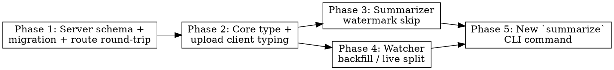

# Plan: Distinguish Backfill vs Live Sessions

> **Source:** docs/spec/distinguish-backfill-live/{design,spec}.md
> **Created:** 2026-05-12
> **Status:** planning

## Goal

Stop the watcher from auto-summarizing pre-existing JSONL files at startup. Add a watermark on the summary row so already-summarized sessions skip future re-summarization unless ≥ 5 new events have arrived. Provide an explicit `claude-sessions summarize` command for users to opt historical sessions in.

## Acceptance Criteria

- [ ] `claude-sessions watch` against a folder of N pre-existing JSONLs triggers 0 `claude -p` invocations.
- [ ] A new chokidar `add`/`change` event for a JSONL after watcher startup triggers exactly 1 summarization (subject to the watermark gate).
- [ ] A session with an existing `ok` summary skips re-summarization if `currentEventCount - summarized_event_count < 5`.
- [ ] `summaries` table has a nullable `summarized_event_count` column; round-trips through POST→GET.
- [ ] `claude-sessions summarize <id>` and `summarize --all [--force] [--yes] [--since <ISO>]` work as specified.
- [ ] All new code covered by unit tests; existing tests stay green.

## Codebase Context

### Existing Patterns to Follow
- **Vitest + execFile mocks for subprocess testing**: `packages/cli/src/summarizer/claude-runner.test.ts`.
- **In-process HTTP mock server for CLI integration tests**: `packages/cli/tests/helpers/mock-server.ts` — already used by `watch.test.ts`, `enable.test.ts`, etc.
- **Drizzle schema + raw-SQL migration kept hand-in-sync**: see `0001_init.sql` + `schema.ts`. New migrations land as `0003_*.sql`.
- **Zod-validated POST handlers** for summary route: `packages/server/src/routes/sessions.ts:22` (`summarySchema`).
- **Yargs-style command wiring**: `packages/cli/src/main.ts` (existing `watch`, `sync`, `enable`, etc.).
- **Summarizer concurrency + retry pattern**: `packages/cli/src/summarizer/index.ts`.

### Watermark fetch
Use existing `UploadClient.getSession(sessionId)` (`packages/cli/src/upload/client.ts:175`) — already returns the embedded summary. We just need to extend the server response shape and the typed CLI client wrapper.

### Test Infrastructure
- Test runner: vitest. Run via `bun run --filter <pkg> test` or repo-root `bun run test`.
- Server unit tests don't need testcontainers; only integration tests do (env-blocked locally — written but allowed to skip if Docker unavailable).
- CLI integration tests use in-process mock server; no real server needed.

## Phase Graph

Phases 3 and 4 can run in parallel after phase 2. Phase 5 is the integration step that depends on both.

## Phases

- **Phase 1** — Add the `summarized_event_count` column to the `summaries` table, write the migration, extend the POST/GET routes to accept and return it. Server-only; no CLI impact yet. (REQ-007, EDGE-010)
- **Phase 2** — Extend `SessionSummary` in `@claude-sessions/core` with the optional field; type the upload client's `getSession`/`uploadSummary` to know about it. Pure-types phase; no behavior change. (REQ-014)
- **Phase 3** — Implement the watermark skip in `Summarizer.summarize`: fetch existing summary, compare counts, skip if `delta < minResumarizeDelta` and prior status is `ok`. Add `force` to `summarize()` and constructor option `minResumarizeDelta` (default 5). (REQ-003, REQ-004, REQ-005, REQ-006, REQ-012, REQ-013, EDGE-003, EDGE-004, EDGE-005)
- **Phase 4** — Split the watcher's `consumeSafe` to take an `armEndDetect` flag. Catch-up calls with `false`; chokidar `add`/`change` calls with `true`. (REQ-001, REQ-002, EDGE-001, EDGE-002, EDGE-011, EDGE-014)
- **Phase 5** — New `claude-sessions summarize` command. Single-id and `--all` flows, `--force`, `--since`, `--yes`, confirmation prompt. Wires the same `Summarizer` instance and reuses watermark gate (bypassed by `--force`). (REQ-008, REQ-009, REQ-010, REQ-011, EDGE-006, EDGE-007, EDGE-008, EDGE-009, EDGE-012, EDGE-013)
