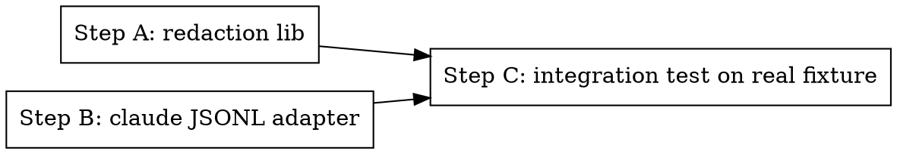

# Phase 1: Claude adapter + redaction

> **Status:** pending
> **Depends on:** Phase 0
> **Traces to:** REQ-003, REQ-004, REQ-005, REQ-006, EDGE-001

## Step Graph



Steps A and B are independent and can run in parallel.

## Overview

Two libraries:

1. **`@claude-sessions/core` redaction** — finds and replaces secrets in arbitrary strings.
2. **`@claude-sessions/adapter-claude`** — reads a Claude Code JSONL file and emits canonical events. Handles streaming for large files.

After this phase you can run `node -e "require('@claude-sessions/adapter-claude').readSession('/path/to.jsonl').then(s => console.log(s.events.length))"` and get a canonical session out.

---

## Step A: Redaction library

### Files

- Create: `claude-sessions/packages/core/src/redact.ts`
- Test: `claude-sessions/packages/core/src/redact.test.ts`

### Patterns to detect (REQ-005)

```ts
const PATTERNS: Array<{ kind: string; re: RegExp }> = [
  { kind: "aws-access-key",    re: /\bAKIA[0-9A-Z]{16}\b/g },
  { kind: "aws-secret-key",    re: /\b[A-Za-z0-9/+]{40}\b/g },               // tighten with context
  { kind: "github-token",      re: /\b(ghp|gho|ghu|ghs|ghr)_[A-Za-z0-9]{36,}\b/g },
  { kind: "openai-key",        re: /\bsk-[A-Za-z0-9]{20,}\b/g },
  { kind: "anthropic-key",     re: /\bsk-ant-[A-Za-z0-9-]{90,}\b/g },
  { kind: "jwt",               re: /\beyJ[A-Za-z0-9_-]+\.[A-Za-z0-9_-]+\.[A-Za-z0-9_-]+\b/g },
  { kind: "oauth-bearer",      re: /\bBearer\s+[A-Za-z0-9._-]{20,}\b/gi },
  { kind: "private-key-pem",   re: /-----BEGIN [A-Z ]*PRIVATE KEY-----[\s\S]+?-----END [A-Z ]*PRIVATE KEY-----/g },
  { kind: "env-line",          re: /^[A-Z][A-Z0-9_]{2,}=.+$/gm },             // line-anchored
];
```

### Entropy detection (REQ-006)

```ts
function shannonEntropy(s: string): number {
  const freq = new Map<string, number>();
  for (const c of s) freq.set(c, (freq.get(c) ?? 0) + 1);
  let h = 0;
  for (const n of freq.values()) {
    const p = n / s.length;
    h -= p * Math.log2(p);
  }
  return h;
}

function isHighEntropyToken(token: string): boolean {
  return token.length >= 32 && shannonEntropy(token) >= 4.5;
}
```

After regex pass, tokenize remaining text on whitespace + common separators and replace high-entropy tokens with `[REDACTED:high-entropy]`.

### Public API

```ts
export interface RedactResult {
  redacted: string;
  hits: Array<{ kind: string; count: number }>;
}

export function redact(input: string): RedactResult;
```

### Tests

- Each pattern in `PATTERNS` redacts (one fixture per pattern)
- Repeated `aaaa…` (low entropy, length 40) is NOT redacted (REQ-006 negative)
- Random base64 blob (high entropy, length 40) IS redacted
- Idempotent: `redact(redact(s).redacted).redacted === redact(s).redacted`
- Returns hit counts per kind

---

## Step B: Claude JSONL adapter

### Files

- Create: `claude-sessions/packages/adapter-claude/src/index.ts`
- Create: `claude-sessions/packages/adapter-claude/src/stream.ts`
- Test: `claude-sessions/packages/adapter-claude/src/index.test.ts`
- Fixtures: `claude-sessions/packages/adapter-claude/__fixtures__/sample-session.jsonl` (small synthetic), `__fixtures__/empty-session.jsonl`, `__fixtures__/malformed.jsonl`

### Public API

```ts
import type { CanonicalEvent, CanonicalSession } from "@claude-sessions/core";

export interface AdapterOptions {
  /** start parsing at this byte offset (resume) */
  byteOffset?: number;
}

/** Read whole session synchronously (for small files / tests). */
export function readSessionSync(path: string, opts?: AdapterOptions): CanonicalSession;

/** Stream events from a JSONL file, yielding new events as they arrive. */
export async function* streamEvents(
  path: string,
  opts?: AdapterOptions
): AsyncIterable<CanonicalEvent>;

/** Parse a single JSONL line into 0+ canonical events. */
export function parseLine(line: string): CanonicalEvent[];
```

### Mapping from raw to canonical

| Raw `type` | Canonical event |
|------------|-----------------|
| `user` | `{ type: "user_msg", content_md: <stringified content>, raw }` |
| `assistant` (content has only text) | `{ type: "assistant_msg", content_md, raw }` |
| `assistant` (content has `tool_use`) | one `assistant_msg` (text portion) + one `tool_use` per `tool_use` block |
| `user` with `tool_result` content | one `tool_use` event with the previous `tool_use_id` matched (output_summary populated) |
| `system` | `{ type: "system", kind: subtype, content, raw }` |
| `attachment` | `{ type: "system", kind: `attachment.${attachment_type}`, content, raw }` |
| `file-history-snapshot` | `{ type: "system", kind: "file-snapshot", content: "(snapshot)", raw }` |
| `last-prompt` | drop (display-only state) |
| anything else | `{ type: "system", kind: "unknown", content: JSON.stringify(raw), raw }` (REQ-004) |

### Session aggregation rules

For `readSessionSync`:
- `id` = first event's `sessionId`
- `agent` = `"claude-code"`, `agent_version` = first event's `version`
- `cwd` = first event's `cwd`
- `branch` = first event's `gitBranch`
- `started_at` = first event's `timestamp`
- `ended_at` = last event's `timestamp`
- `model` = last seen `assistant.message.model`
- `total_input_tokens` = sum of `assistant.message.usage.input_tokens` over events
- `total_output_tokens` = sum of `assistant.message.usage.output_tokens`
- `total_cost_usd` = computed via `computeCost(model, usage)` from `core/pricing.ts`
- `permission_mode` = last seen `permissionMode`
- `worktree_path` = `cwd` (overridden later by repo-detect if it's a worktree)
- `repo` = `null` here; repo-detect resolves it
- `raw_jsonl_blob_url` = `null` here

### Tool call matching

Build a map `tool_use_id → assistant_msg index` while parsing. When a `user` event with `tool_result` content arrives, find the matching `tool_use` event and populate `output_summary`. If no match (interrupted session, EDGE-013), leave output_summary undefined.

### Streaming

```ts
import { createReadStream } from "node:fs";
import { createInterface } from "node:readline";

export async function* streamEvents(path: string, opts: AdapterOptions = {}): AsyncIterable<CanonicalEvent> {
  const stream = createReadStream(path, { start: opts.byteOffset ?? 0, encoding: "utf8" });
  const rl = createInterface({ input: stream, crlfDelay: Infinity });
  for await (const line of rl) {
    if (!line.trim()) continue;
    try {
      yield* parseLine(line);
    } catch (err) {
      // EDGE-001: skip malformed JSON, but record via stats sink (out-of-band)
      yield {
        type: "system",
        ts: new Date().toISOString(),
        kind: "parse_error",
        content: (err as Error).message,
        raw: { line }
      };
    }
  }
}
```

### Tests

- `parseLine` handles each raw `type` correctly (REQ-003)
- Unknown type → emits `system` event with `kind: "unknown"` (REQ-004)
- Malformed JSON line → yields `parse_error` system event, continues stream (EDGE-001)
- `readSessionSync` on `sample-session.jsonl` produces a `CanonicalSession` with `events.length === N` and metadata fields populated
- Resume from byteOffset: read first half, then resume from the recorded offset, ensure no duplicates and no skips
- Tool use ↔ tool result matching: synthetic fixture with one tool call; resulting `tool_use` event has both input and output_summary

---

## Step C: Integration test against a real Claude session

Use the recovered JSONL excerpt from `pin/PROMPT.md` history (or the user's own most-recent vibe-tools session) as a real fixture. Trim PII first.

- File: `claude-sessions/packages/adapter-claude/__fixtures__/real-pin-session.jsonl` (sanitized)
- Test verifies: parses without crashing, emits >0 events of each canonical type, session metadata has plausible values (positive token counts, non-empty cwd/branch)

---

## Done When

- [ ] `redact()` passes all pattern + entropy + idempotency tests
- [ ] `readSessionSync` on small fixture returns expected canonical session
- [ ] `streamEvents` resumable from byteOffset, no duplicates
- [ ] Malformed line handled, doesn't kill the stream
- [ ] Real-session fixture parses cleanly
- [ ] `bun test packages/core packages/adapter-claude` passes

## Commit

`feat(adapter-claude): JSONL → canonical events + redaction lib`
