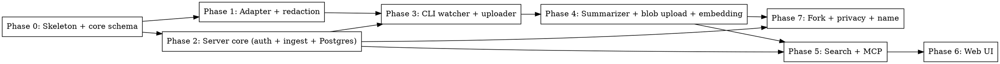

# Plan: Claude Session Finder & Cloud Sync

> **Source:** `docs/plans/2026-05-09-claude-session-finder-design.md`, `docs/spec/claude-session-finder/spec.md`, `docs/spec/claude-session-finder/summary-schema.md`
> **Created:** 2026-05-09
> **Status:** planning

## Goal

Ship a personal-cloud product (phases 0–2 from the design) that indexes Claude Code sessions, summarizes them with `claude -p`, syncs opted-in repos to a single-process cloud backend, and serves a beautiful web UI + MCP server for searching and visualizing sessions, with PR auto-linking and fork-from-checkpoint.

## Architecture (final, simplified)

- **CLI** owns all intelligence: watch, parse, redact, summarize, mine PRs, fork. Single binary. Persists only `~/.claude-sessions/state.json` (per-file byte offsets).
- **Server** is a thin Hono process: ingest, summary store + inline embedding, blob bytea store, hybrid search, MCP, web UI assets. **No worker, no Redis, no SQLite.**
- **Postgres** holds everything: sessions, events, summaries, embeddings (pgvector), blobs (bytea), audit log.

## Acceptance Criteria

- [ ] `claude-sessions enable <repo>` registers the repo and starts watching (REQ-010, REQ-013, REQ-014)
- [ ] `claude-sessions disable <repo>` stops sync (REQ-012)
- [ ] CLI parses, redacts, batch-uploads events to server within ~1s of write (REQ-014, REQ-005, REQ-033)
- [ ] CLI summarizes via `claude -p` after 60s silence; server stores summary + generates embedding inline (REQ-016, REQ-017, REQ-038)
- [ ] CLI uploads raw JSONL to `session_blobs` (bytea) (REQ-061)
- [ ] `claude-sessions fork <id> --until <uuid> --cwd <path>` produces a working `claude --resume`-able JSONL (REQ-051, REQ-052)
- [ ] Web UI: repo-first home, transcript view with sticky header + summary panel + Claude.ai-style chat (REQ-023, REQ-024)
- [ ] Hybrid search (FTS + pgvector RRF) returns ranked sessions (REQ-022)
- [ ] MCP server with 6 tools (REQ-029)
- [ ] Per-session privacy via sidecar file (REQ-039, REQ-040)

## Codebase Context

### Existing Patterns to Follow

- **`pin/pin.py`** — pattern for shelling out to `claude -p` with `--json-schema`, `--setting-sources ""`, `--no-session-persistence`, `--disallowedTools`. The CLI's summarizer uses the same pattern.
- **`aibash/aibash.py`** — same `claude -p` invocation pattern; reference for parsing `structured_output` from response envelope.

### Stack

- **Runtime:** Node 22, Bun for dev (faster), npm/node for shipping
- **Monorepo:** Turborepo + workspaces
- **Backend:** Hono (`@hono/node-server`)
- **DB:** Postgres 16 + `pgvector` extension
- **ORM:** Drizzle
- **Validation:** Zod
- **Embedding model:** OpenAI `text-embedding-3-small` (default), self-hosted `bge-small-en-v1.5` via ONNX runtime as alt
- **File watcher:** `chokidar`
- **Web app:** Vite + React 18 + Tailwind v4 + shadcn/ui + TanStack Query
- **Markdown rendering:** `react-markdown` + `remark-gfm` + `rehype-shiki`
- **Auth:** email + password, `@node-rs/argon2`, JWT via `jose`, httpOnly cookies for web
- **MCP server:** `@modelcontextprotocol/sdk` over HTTP+SSE, mounted on the same Hono process
- **Test runner:** Vitest, Playwright for web E2E
- **Lint/format:** Biome

### Project Layout

```
claude-sessions/
├── README.md
├── PROMPT.md
├── package.json                      # workspaces root
├── turbo.json
├── biome.json
├── tsconfig.base.json
├── docker-compose.yml                # postgres + pgvector for local dev
├── .env.example
├── packages/
│   ├── core/                         # types, redaction, repo-detect, pricing
│   ├── adapter-claude/               # JSONL → canonical events
│   ├── cli/                          # `claude-sessions` binary
│   │   └── src/
│   │       ├── commands/             # login, enable, disable, find, open,
│   │       │                         # mcp, fork, name, status, watch, sync
│   │       ├── watcher.ts
│   │       ├── summarizer.ts
│   │       ├── uploader.ts
│   │       └── state.ts              # state.json read/write
│   ├── server/                       # Hono API + MCP + web SPA
│   │   └── src/
│   │       ├── routes/
│   │       │   ├── auth.ts
│   │       │   ├── ingest.ts
│   │       │   ├── sessions.ts       # incl. summary, blob, fork-source
│   │       │   ├── search.ts
│   │       │   └── mcp.ts
│   │       ├── db/
│   │       │   ├── schema.ts         # drizzle
│   │       │   └── migrations/
│   │       └── embed/
│   │           ├── openai.ts
│   │           └── bge.ts            # ONNX
│   ├── web/                          # Vite SPA
│   └── test-config/                  # shared vitest config
└── apps/
    └── e2e/                          # cross-package integration scenarios
```

## Phase Graph



### Wave dispatch

- **Wave 1**: P0 (skeleton)
- **Wave 2**: P1 (adapter+redaction), P2 (server core) — independent, parallel
- **Wave 3**: P3 (CLI watcher) — depends on P1+P2
- **Wave 4**: P4 (summarizer + blob + embedding) — depends on P3
- **Wave 5**: P5 (search + MCP), P7 (fork + privacy + name) — parallel
- **Wave 6**: P6 (web UI) — depends on P5

8 phases (0–7). The cut-scope you requested was "phases 0–5". Mapping the cut scope to this new numbering: phases 0–4 give you a fully working local indexer that talks to a real cloud server; phase 5 adds the search and MCP that make it useful from outside the web UI. **Recommended v0 = phases 0–5.** Phase 6 (web UI) and Phase 7 (fork + privacy) are stretch.

## Phase Summaries

| # | Title | Delivers | Key REQs |
|---|-------|----------|----------|
| 0 | Skeleton + core schema | TS monorepo set up; canonical types; pricing; tests pass | REQ-001, REQ-002, REQ-049 |
| 1 | Adapter + redaction | JSONL → canonical events; secret redaction lib | REQ-003, REQ-004, REQ-005, REQ-006, EDGE-001 |
| 2 | Server core | Hono + Postgres + Drizzle + pgvector; auth (login/me); /api/ingest with dedupe + RBAC + redaction-at-rest | REQ-030, REQ-031, REQ-032, REQ-033, REQ-034, REQ-035, REQ-041, REQ-048, REQ-049, REQ-063 |
| 3 | CLI watcher + uploader | `enable`/`disable`/`status`; chokidar watcher; debounced batch POST; state.json; backfill | REQ-010, REQ-011, REQ-012, REQ-013, REQ-014, REQ-015, REQ-042, REQ-045, REQ-046, REQ-058 |
| 4 | Summarizer + blob + embedding | 60s end-detection; `claude -p` with summary-schema.md; deterministic field merge; PR mining; blob upload; **inline embedding generation on server** | REQ-016, REQ-017, REQ-018, REQ-019, REQ-026, REQ-027, REQ-028, REQ-038, REQ-043, REQ-044, REQ-061, REQ-062, EDGE-004, EDGE-013 |
| 5 | Search + MCP | `/api/search` (FTS + pgvector RRF); MCP server with 6 tools; per-user MCP token | REQ-022, REQ-029, REQ-047 |
| 6 | Web UI | Repo-first home; transcript view (sticky header + expandable summary panel + Claude.ai-style chat) | REQ-020, REQ-021, REQ-023, REQ-024, REQ-025 |
| 7 | Fork + privacy + name | `fork` command (server returns blob, CLI truncates+rewrites); `name` command; sidecar `.private` file honoring; audit log | REQ-036, REQ-037, REQ-039, REQ-040, REQ-050–REQ-056, REQ-059, REQ-060, EDGE-021–EDGE-024 |

## Phase docs

Phase files exist for the original 12-phase plan. With the simplification:
- **`phase-0.md`** — still valid (skeleton)
- **`phase-1.md`** — still valid (adapter + redaction)
- **`phase-2.md`** — REPLACE with new "Server core" content (no longer about local SQLite)
- **`phase-3.md`** — REPURPOSE for new CLI watcher + uploader (not "sync agent with SQLite cache")
- **`phase-4.md`** — REPURPOSE for summarizer + blob + embedding (combine old summarizer + new blob/embedding)
- **`phase-5.md`** — write new (search + MCP)
- **`phase-6.md`** — write new (web UI)
- **`phase-7.md`** — write new (fork + privacy + name)

The implementer's job: read phase 0 + 1 (already detailed), proceed to 2, etc. Phases 5–7 are condensed below since the repo conventions and patterns are well-established by the time the coder gets there.

## Open Decisions (flagged but not blocking)

- **D1**: 60s session-end threshold — confirmed.
- **D2**: Cloud hosting — Fly.io with Neon for Postgres. Confirm at deploy time.
- **D3**: MCP token format — JWT with audience `mcp`, embedded in URL `https://app.host/mcp/<token>`.
- **D4**: Truncation policy — first 50k + last 200k tokens. Confirmed.
- **D5**: Redaction rule for env-var lines — whole-line `[A-Z_]+=...` → `[REDACTED:env-line]`. Confirmed.
- **D6**: Embedding model — OpenAI `text-embedding-3-small` default, self-hosted `bge-small-en-v1.5` (ONNX, ~80MB) for offline/cost-sensitive deployments. Server picks via `EMBED_PROVIDER=openai|bge` env var.
- **D7**: Audit log retention — keep indefinitely for v0; revisit at scale.

## Approval

This plan flows directly into Stage 3 (Coder) per the orchestrator's auto-mode rules. Phases 0 and 1 are pre-detailed. Phases 2–7 are summarized here; the coder will fill in detail per phase as it dispatches each.
